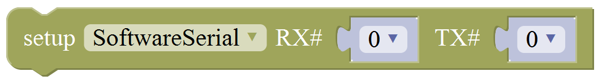
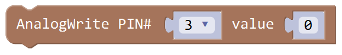
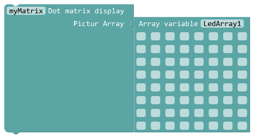
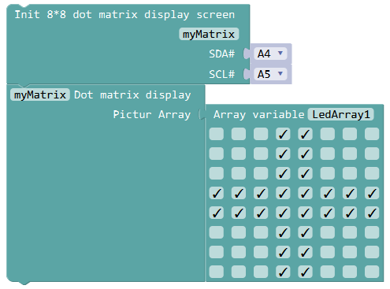
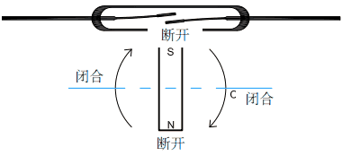
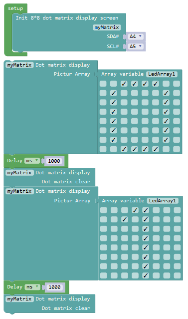
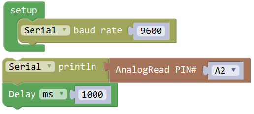
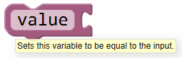
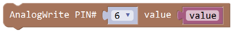

# **KD0001 Kidsbits Multi-purpose Coding Box Kit Mixly tutorial**

****

## **1.Introduction**

You can create a heap of fancy and cool things based this coding box kit.
Like blinking LED, alarm navigator, smart fan, responder, ect.

We focus on puzzle programming, design and development of toy blocks!
Combing the building block toy market and the maker education market
effectively combined to create a favorite manufacturing brand for children,
a mainstream open source programming platform.

**Download the Projects tutorial:**

<https://kd.kidsbits.cc/KD0001>

**Download the Mixly software WIN:**

<https://www.dropbox.com/s/iuerl3n5wqki99x/Mixly0.998_WIN%287.9%29.rar?dl=0>

**Download the Mixly software MAC:**

<https://www.dropbox.com/s/6lvsmvh0prh7udi/Mixly0.998_MAC%287.8%29.zip?dl=0>

##  **2.Connection Diagram**

My interface has V, G, S pins, V is for the positive pole, G is for the
negative pole, and S pin for the digital port of yellow coding robot Each
interface of the yellow coding robot is assembled with the positive pole,
the negative pole and the digital port. Take my interface out with a wire
and connect it to the digital interface D of the yellow coding robot .

## **3.Getting Started with Mixly**

**Introduction for Mixly**

Mixly is a free open-source graphical Arduino programming software, based on
Google’s Blockly graphical programming framework, and developed by Mixly
Team@ BNU.

It is a free open-source graphical programming tool for creative electronic
development; a complete support ecosystem for creative e-education; a stage
for maker educators to realize their dreams.

Although there is an Ardublock graphical programming software launched by
Arduino official, Ardublock is not perfect enough, and many common functions
cannot be realized.

**The figure below shows the functional comparison between Ardublock and
Mixly.**

****

It can be said that Mixly is the most versatile and smoothest Arduino graphical
programming software, which can replace the Arduino programming tool IDE.

**Design Concept and User Groups**

**Design Concept**

（1）Usability

Mixly is designed to be completely green. Currently Mixly supports win, ubuntu,
mac. Windows users can download the Mixly package directly from the Internet,
and unzip it to run on Windows XP and above (download link is attached below).

(2) Simplicity

Mixly uses the Blockly graphical programming engine to replace complex text
manipulation with graphical building blocks, providing a good foundation for
beginners to get started quickly.

1.  Use the different color icons to represent different types of functional
    blocks, very convenient for users to classify.

2.  Provide default options in the composite function block to effectively
    reduce the number of user drags.

3.  Integrate all the features of the software in the same interface.

4.  Provide the reference tutorial and code examples.

(3) Functionality

It has versatile functions. Mixly can almost implement all the functions that
Arduino IDE has. Support all official development boards of arduino.

(4) Continuity

The goal of the graphical programming system is definitely not to replace the
original text programming method, but to better understand the programming
principles and program thinking through graphical programming, and lay the
foundation for future text programming.

It is also the design philosophy for Mixly. More continuous content has been
added to the design of the software to protect the user's learning outcomes. To
be specific, it includes the introduction of variable types, the consistency of
text programming as much as possible in the design of the module, and the
support of both graphical and text programming.

(5) Ecological

The most important design concept of Mixly is its ecological feature, which can
distinguish it from other Arduino graphical programming.

In order to achieve sustainable development, Mixly is designed to allow
manufacturers to develop their own unique modules (currently supports DfRobot,
StartLab, MakeBlock, Sense, Seeed, Lubot. But users require

JavaScript programming foundation to make this part of the module).

It also allows users directly use Mixly's graphical programming function to
generate common modules (such as LED digital display, buzzer broadcast, etc.
Users are able to make this part of the module onlyusing Mixly).

Both of the two kinds of modules mentioned above can be imported into the Mixly
system through the "Import" function, thereby realizing the user's own value in
the popularity of Mixly software.

**User Groups**

From the above design concept, it can be seen that Mixly is suitable for primary
and secondary school students to cultivate programming thinking. It is also
available for quick programming when creating a work. Of course, it is good for
those lovely friends who don't want to learn text programming, but want to do
some small works with intelligent control.

**Interface Functions of Mixly**

**System Functions**

Look at the main interface of Mixly, it includes five parts, that is, Blocks
selection, code edit, text code (hidden), system function and message prompt
area. Shown below.

**Some common functions:**

Through this interface, you can complete the code compile、upload、save and
manage. It support four remove methods: drag it left out code window, or drag to
Recycle Bin, delete key, or right-click to delete block. It supports four
languages: English、Español (Spanish)、中文简体(Chinese
Simplified)、中文繁体(Chinese Traditional).

**In/Out Block**

| **NO.**  | **BLOCK ICON**                                  | **DEFINITION**                                                                                                                                                                                                      |
|----------|-------------------------------------------------|---------------------------------------------------------------------------------------------------------------------------------------------------------------------------------------------------------------------|
| **1**    |  | Returns HIGH or LOW voltage                                                                                                                                                                                         |
| **2**    |  | Write digital value to a specific Port. Digital Output: set the HIGH or LOW output for IO pins                                                                                                                      |
| **3**    |  | Returns a digital value of a specific Port. Digital IO Read Pin, generally used to read the HIGH or LOW level detected by Digital sensor                                                                            |
| **4**    |  | Write analog value between 2 and 255 to a specific Port.  Analog Output: set the Analog value output by Analog IO pins (0\~255).                                                                                    |
| **5**    |  | Returns value between 0 and 1023 of a specific Port.  Analog IO Read Pin, generally used to read the Analog value detected by Analog sensor.                                                                        |
| **6**    |  | External Interrupts function, with three trigger interrupt modes RISING, FALLING, CHANGE.                                                                                                                           |
| **7**    |  | Detachs interrupt to a specific Port. Turn off the given interrupt function.                                                                                                                                        |
| **8**    |  | Set the IO pins as Output or Input state                                                                                                                                                                            |
| **9**    |  | Read the continuous time of HIGH or LOW pulse from IO pins ( generally used for ultrasonic ranging)                                                                                                                 |
| **10**   |  | Read a pulse (either HIGH or LOW) on a pin within a time set in timeout.                                                                                                                                            |
| **11**   |  | Set the ShiftOut data pin, clock pin. Output the data needed from the bitOrder MSBFIRST or LSBFIRST (Most Significant Bit First, or, Least Significant Bit First). Generally used for controlling the 74HC595 CHIP. |
| **12**   |  | This is the function interface under Normal mode. If select Advanced mode, the functions will be more.                                                                                                              |

**For example:**

Connect your Arduino Uno board, then follow the steps below to light the Pin13
led on Arduino UNO.

**Control Block**

| **NO.** | **BLOCK ICON**                                  | **DEFINITION**                                                                                                                                                                                                                                                               |
|---------|-------------------------------------------------|------------------------------------------------------------------------------------------------------------------------------------------------------------------------------------------------------------------------------------------------------------------------------|
| **1**   |  | Initialization (run only once)                                                                                                                                                                                                                                               |
| **2**   |  | End the program, means the program will stop running when use this block.                                                                                                                                                                                                    |
| **3**   |  | Delay function, click to select **ms** or **us**  (pause the program for the amount of time (in milliseconds) specified as parameter. There are 1000 milliseconds in a second.)                                                                                              |
| **4**   |  | **if_do** function (first evaluate a value be [true or false](https://www.arduino.cc/reference/en/language/variables/constants/constants/), if a value is true, then do some statement. You can click the blue gear icon to select the **else if** block or **else** block.) |
| **5**   |  | **switch** function. You can click the blue gear icon to select the **case** block or **default** block. (used to evaluate several programs then execute the corresponding function matched with program.)                                                                   |
| **6**   |  | Equal to [**for** statement](https://www.arduino.cc/reference/en/language/structure/control-structure/for/).                                                                                                                                                                 |
| **7**   |  | A **while** loop statement.                                                                                                                                                                                                                                                  |
| **8**   |  | **break** function, used to exit from the containing loop.                                                                                                                                                                                                                   |
| **9**   |  | **millis()** function, returns the system running time since the program started. (The unit can be **ms** (milliseconds) or **μs**（microsecond)).                                                                                                                           |
| **10**  |  | Timer interrupt function, that is, set a trigger interrupt for the amount of time (in milliseconds) specified as parameter.                                                                                                                                                  |
| **11**  |  | Timer interrupt start block                                                                                                                                                                                                                                                  |
| **12**  |  | Timer interrupt stop block                                                                                                                                                                                                                                                   |

**For example:**

Compile and upload the program below to your Arduino board, you should see Pin13
LED on Arduino UNO continue to flash.(with an interval of 1s, equal to 1000ms)

**Math Block**

| **NO.** | **BLOCK ICON**                                  | **DEFINITION**                                                                                                                                                                                                                                                                                                                                                                                                                                                                                                                                                                                                                                                                                                                                            |
|---------|-------------------------------------------------|-----------------------------------------------------------------------------------------------------------------------------------------------------------------------------------------------------------------------------------------------------------------------------------------------------------------------------------------------------------------------------------------------------------------------------------------------------------------------------------------------------------------------------------------------------------------------------------------------------------------------------------------------------------------------------------------------------------------------------------------------------------|
| **1**   |  | A number                                                                                                                                                                                                                                                                                                                                                                                                                                                                                                                                                                                                                                                                                                                                                  |
| **2**   |  | Click to select the Arithmetic Operators:  [**＋(addition)**](https://www.arduino.cc/reference/en/language/structure/arithmetic-operators/addition/)**;** [**－(subtraction)**](https://www.arduino.cc/reference/en/language/structure/arithmetic-operators/subtraction/)**;**  [**x (Multiplication)**](https://www.arduino.cc/reference/en/language/structure/arithmetic-operators/multiplication/)**;** [**÷ (division)**](https://www.arduino.cc/reference/en/language/structure/arithmetic-operators/division/)**;** [ **% (remainder)**](https://www.arduino.cc/reference/en/language/structure/arithmetic-operators/remainder/)**;**[ **\^ (bitwise xor)** ](https://www.arduino.cc/reference/en/language/structure/bitwise-operators/bitwisexor/) |
| **3**   |  | Click to select the [**& (bitwise end)**](https://www.arduino.cc/reference/en/language/structure/bitwise-operators/bitwiseand/)**;** [**l (bitwise or)**](https://www.arduino.cc/reference/en/language/structure/bitwise-operators/bitwiseor/)**;** [**\<\< (bitshift left)**](https://www.arduino.cc/reference/en/language/structure/bitwise-operators/bitshiftleft/)**;** [ **\>\> (bitshift right)**](https://www.arduino.cc/reference/en/language/structure/bitwise-operators/bitshiftright/)                                                                                                                                                                                                                                                         |
| **4**   |  | Click to select the [**sin**](https://www.arduino.cc/reference/en/language/functions/trigonometry/sin/)**;** [**cos**](https://www.arduino.cc/reference/en/language/functions/trigonometry/cos/)**;** [**tan**](https://www.arduino.cc/reference/en/language/functions/trigonometry/tan/)**; asin; acos; atan; ln; log10; e\^; 10\^;** [**++ (increment)**](https://www.arduino.cc/reference/en/language/structure/compound-operators/increment/) **;**  [**-- (decrement)**](https://www.arduino.cc/reference/en/language/structure/compound-operators/decrement/)                                                                                                                                        |
| **5**   |  | Click to select the **Round; Ceil; Floor;** [**abs**](https://www.arduino.cc/reference/en/language/functions/math/abs/)**;** [**sq**](https://www.arduino.cc/reference/en/language/functions/math/sq/)**;** [**sqrt** ](https://www.arduino.cc/reference/en/language/functions/math/sqrt/) **Round:** Returns the integer part a number using around. **Ceil:** Returns the integer part a number using ceil. **Floor:** Returns the integer part a number using floor. **abs:** Return the absolute value of a number. **sq:** Return the square of a number. **sqrt:** Return the square root of a number.                                                                                                                                              |
| **6**   |  | If select the **max**, returns the larger number;  if select the **min**, returns the smaller number.                                                                                                                                                                                                                                                                                                                                                                                                                                                                                                                                                                                                                                                     |
| **7**   |  | Initialize the random seed                                                                                                                                                                                                                                                                                                                                                                                                                                                                                                                                                                                                                                                                                                                                |
| **8**   |  | Return a random integer between the two specified limits, inclusive.                                                                                                                                                                                                                                                                                                                                                                                                                                                                                                                                                                                                                                                                                      |
| **9**   |  | Constrain a number to be between the specified limits (inclusive).  (generally used to constrain an analog value read from sensor)                                                                                                                                                                                                                                                                                                                                                                                                                                                                                                                                                                                                                        |
| **10**  |  | Map a number from the first interval to the second interval.  (For instance, potentiometer-controlled servo, map the range of potentiometer (0, 1023) to the angle of servo (0, 180)).                                                                                                                                                                                                                                                                                                                                                                                                                                                                                                                                                                    |

**Text Block**

****

| **NO.** | **BLOCK ICON**                                  | **DEFINITION**                                                                                                                                      |
|---------|-------------------------------------------------|-----------------------------------------------------------------------------------------------------------------------------------------------------|
| **1**   |  | character string: a letter, word, or line of text.                                                                                                  |
| **2**   |  | A character                                                                                                                                         |
| **3**   |  | Creates a piece of text by joining together two piece of text.  ( Here Hello join Mixly equals HelloMixly)                                          |
| **4**   |  | Converts a string into an integer or an float.                                                                                                      |
| **5**   |  | Returns the char corresponding to an ASCII code  (Decimal number 97 corresponding to a)                                                             |
| **6**   |  | Returns the ASCII code corresponding to a char.                                                                                                     |
| **7**   |  | Converts a number into a string.                                                                                                                    |
| **8**   |  | Calculates the length of a string                                                                                                                   |
| **9**   |  | Output the char of a string (the char at 0 of hello is h)                                                                                           |
| **10**  |  | The first string equals or startsWith or endsWith the second string, returns 1, otherwise returns 0. (if equals, both strings are abc, returns 1.)  |
| **11**  |  | Returns a decimal value of the first string subtracts the second string.                                                                            |

**List Block**

****

| **NO.** | **BLOCK ICON**                                  | **DEFINITION**                                                                                       |
|---------|-------------------------------------------------|------------------------------------------------------------------------------------------------------|
| **1**   |  | Create a list with any number of items                                                               |
| **2**   |  | Creats a list from a text. (int mylist [ ]={0,0,0};)                                                 |
| **3**   |  | Returns the length of a list                                                                         |
| **4**   |  | Returns the value of at the specified position in a list.                                            |
| **5**   |  | Sets the value of at the specified position in a list. Set the first item in mylist to another item. |

**Logic Block**

****

| **NO.** | **BLOCK ICON**                                   | **DEFINITION**                                                                                                                                                                                                                                                                                                                                                                                                                                                           |
|---------|--------------------------------------------------|--------------------------------------------------------------------------------------------------------------------------------------------------------------------------------------------------------------------------------------------------------------------------------------------------------------------------------------------------------------------------------------------------------------------------------------------------------------------------|
| **1**   |   |  **logic comparision**  **=**: Return true if both inputs equal each other. **≠** : Return true if both inputs are not equal to each other. **\<**: Return true if the first input is smaller than the second input. **≤** : Return true if the first input is smaller than or equal to the second input. **\>**: Return true if the first input is greater than the second input.  **≥ :** Return true if the first input is greater than or equal to the second input. |
| **2**   |   | **and:** Return true if both inputs are true; **or:** Return true if at least one of the inputs is true                                                                                                                                                                                                                                                                                                                                                                  |
| **3**   |   | Returns true if the input is false. Returns false if the input is true.                                                                                                                                                                                                                                                                                                                                                                                                  |
| **4**   |   | Returns either true or false.                                                                                                                                                                                                                                                                                                                                                                                                                                            |
| **5**   |   | Returns null                                                                                                                                                                                                                                                                                                                                                                                                                                                             |
| **6**   |   | If the first number is true, the second number is returned, otherwise the third number.                                                                                                                                                                                                                                                                                                                                                                                  |

**Variable Block**

****

| **NO.**  | **BLOCK ICON**                                  | **DEFINITION**                                                                                                                                                                                                                                                                                                                                                                                                                                                                                                                                                                                                                                                                                            |
|----------|-------------------------------------------------|-----------------------------------------------------------------------------------------------------------------------------------------------------------------------------------------------------------------------------------------------------------------------------------------------------------------------------------------------------------------------------------------------------------------------------------------------------------------------------------------------------------------------------------------------------------------------------------------------------------------------------------------------------------------------------------------------------------|
| **1**    |  |  Declare and initialize a variable. Click to select [**int**](https://www.arduino.cc/reference/en/language/variables/data-types/int/)**,** [**long**](https://www.arduino.cc/reference/en/language/variables/data-types/long/)**,** [**float**](https://www.arduino.cc/reference/en/language/variables/data-types/float/)**,** [**boolean**](https://www.arduino.cc/reference/en/language/variables/data-types/boolean/)**,** [**byte**](https://www.arduino.cc/reference/en/language/variables/data-types/byte/)**,** [**char**](https://www.arduino.cc/reference/en/language/variables/data-types/char/)**,** [**string** ](https://www.arduino.cc/reference/en/language/variables/data-types/string/)  |
| **2**    |  | Define the data types                                                                                                                                                                                                                                                                                                                                                                                                                                                                                                                                                                                                                                                                                     |

**For example: LED breath**

You need an Arduino Uno and one LED module. Connect the control pin of LED
module to Pin 3 of Uno board (or other pins with “\~”，that is, those pins can
output PWM signal). LED will gradually light then gradually dim, repeatedly.

****

**Serial Port Block**

****

| **NO.**  | **BLOCK ICON**                                  | **DEFINITION**                                                                                                                     |
|----------|-------------------------------------------------|------------------------------------------------------------------------------------------------------------------------------------|
| **1**    |  |  Set the serial buad rate to 9600                                                                                                  |
| **2**    |  | Write the specified number, text or other value.                                                                                   |
| **3**    |  | Print the specified number, text or other value on monitor.                                                                        |
| **4**    |  | Print the specified number, text or other value on newline of monitor.                                                             |
| **5**    |  | Print the specified number in hexademical format on newline of monitor.                                                            |
| **6**    |  | If the serial port is available, it returns true, otherwise returns false. (generally used in Bluetooth communication)             |
| **7**    |  | Returns a string in serial port                                                                                                    |
| **8**    |  | A string read from serial port to a string variable, pause until read the specified character.                                     |
| **9**    |  | Read the serial data by byte (generally used to read the value sent from Bluetooth) (delete the data has been read)                |
| **10**   |  | Wait for the output data completed                                                                                                 |
| **11**   |  | Set the software serial port  (call this function if need to use several serial ports)                                             |
| **12**   |  | Event function trigger by serial port data, that is, serial port is ready to call this function.  (equal to an interrupt function) |

**For example: serial communication**

Done uploading the code, open the Arduino monitor, then enter a “hello” on the
top bar, and click Send, it will print out “hello,world”.

****

Communicate Block

****

| **NO.** | **BLOCK ICON**                                  | **DEFINITION**                                                                                                         |
|---------|-------------------------------------------------|------------------------------------------------------------------------------------------------------------------------|
| **1**   |  |  Do something when receiving infrared signals.                          |
| **2**   |  | Sends infrared signals of the specified types. IR transmitter sends the data, here use the libraries, only PIN3 port.  |
| **3**   |  | Enable IR decoding                                                                                                     |
| **4**   |  | Print the Infrared signal in RAW types when receiving it.                                                              |
| **5**   |  | Sends RAW infrared signals (set the pin number, list, length of list and IR frequency)                                 |

**For example:**

You need an Arduino Uno board, an IR receiver module and an IR remote control.

Connect the signal pin of IR receiver to Digital pin 3 of Uno board, then upload
the code and open the monitor. If send a signal to an IR receiver module using
an IR remote control, you should see the monitor show the corresponding signal
data.

****

**Sensor Block**

****

| **NO.** | **BLOCK ICON**                                  | **DEFINITION**                                                                                                                |
|---------|-------------------------------------------------|-------------------------------------------------------------------------------------------------------------------------------|
| **1**   |  | Set the Trig and Echo pin of ultrasonic sensor. Returns the distance of ultrasonic sensor measured. (**unit:** cm)            |
| **2**   |  | Set the control pin of DHT11 temperature and humidity sensor.  Returns the temperature or humidity of DHT 11 sensor measured. |
| **3**   |  | Set the pin of digital temperature sensor DS18B20. Returns the temperature value of DS18B20 sensor measured.                  |

**For example: ultrasonic ranging**

Connect the Trig pin of ultrasonic sensor to Digital 1 of Uno, Echo pin to D2,
then upload the code and open the monitor, you should see the distance value,
updating once per 100ms.

****

Actuator Block

****

| **NO.** | **BLOCK ICON**                                  | **DEFINITION**                                                                                 |
|---------|-------------------------------------------------|------------------------------------------------------------------------------------------------|
| **1**   |  | Sets the servo pin; Moves between 0-180 degree; Delay time for servo to rotate.                |
| **2**   |  | Returns that degree with the last servo move. Read the degree of servo connected to IO pin set |
| **3**   |  | Set the pin and specified frequency for buzzer to play sound.                                  |
| **4**   |  | Stop playing sound                                                                             |

**For example:**

Connect the signal end of servo to Digital 0 of Uno, then upload the code below,
servo will rotate 90 degrees. Note: Delay 100ms is the time required for servo
to move.

****

**Monitor Block**

****

| **NO.** | **BLOCK ICON**                                  | **DEFINITION**                                                            |
|---------|-------------------------------------------------|---------------------------------------------------------------------------|
| **1**   |  |  Set the IIC LCD1602 address                                              |
| **2**   |  | Input the value on LCD line 1 and line 2 from left to right.              |
| **3**   |  | Set the row and column of LCD to print the char                           |
| **4**   |  | Clear the LCD screen                                                      |
| **5**   |  | Set the control pin and the number of RGB light.                          |
| **6**   |  | Set the RGB light pin, light number and brightness                        |
| **7**   |  | Set the control pin, light number and color. (click to select the color)  |
| **8**   |  | Clear the data, namely turn off digital display                           |
| **9**   |  | Four-digit display, displaying abcd.                                      |
| **10**  |  | Turn on or off the digitdisplay  (here turn on the first digitdisplay)    |

**For example:**

Separately connect the SDA (A4) and SCL (A5) of Arduino Uno to SDA and SCL pins
of IIC LCD1602, then set the address of your LCD1602 screen, the LCD address we
used here is 0x27. Then upload the code, LCD screen has two lines, you should
see the line 1 print HELLO, and line 2 print 123456789.

****

Functions Block

****

| **NO.** | **BLOCK ICON**                                  | **DEFINITION**                                                                                                                         |
|---------|-------------------------------------------------|----------------------------------------------------------------------------------------------------------------------------------------|
| **1**   |  | Creates a function with no output. Click the blue icon to set the procedure parameter. (no return value)                               |
| **2**   |  | Creates a function with an output. Click the blue icon to set the procedure parameter. (with return value and can set the data types)  |
| **3**   |  | If a value is true, then return a second value.                                                                                        |

**For example:**

Below is an example code for line tracking car. We use three tracking modules
(left to D6, middle to D7, right to D8). of course you need a tracking car to
test it. First edit the forward, backward, turn left, turn right and stop into
functions block. Then compile and upload the code below.

****

****

## **4.Installing the Driver**

The USB to serial port chip of this control board is CH340G. So you need to
install the driver for the chip. You can click the driver file here . 
<https://github.com/kidsbits/KD0001---Kidsbits-Coding-Box/tree/main/Install%20Driver>
to download it.

In different systems, the driver installation is similar. Here we start to
install the driver on the Win7 system.

Plug one end of your USB cable into the square interface of the kidsbits coding
box and the other into a USB socket on your computer.

When you connect the kidsbits coding box to your computer at the first time,
right click your “Computer” —\>for “Properties”—\> click the “Device manager”,
under Other devices, you should see the “USB2.0-Serial”.

Then right-click on the
USB2.0-Serial and select the top menu option (Update Driver Software...) shown
as the figure below.

<http://wiki.keyestudio.com/index.php/File:Driver_2.png>

Then it will be prompted to either “Search Automatically for updated driver
software” or “Browse my computer for driver software”. Shown as below. In this
page, select “Browse my computer for driver software”.

After that, select the option to browse and navigate to the “drivers” folder of
usb-ch341 installation.

Once the software has been installed, you will get a confirmation message.
Installation completed, click “Close”.
<http://wiki.keyestudio.com/index.php/File:Driver_6.png>

Up to now, the driver is installed well. Then you can right click “Computer”
—\>“Properties”—\>“Device manager”, you should see the device as the figure
shown below.

## **5.Projects**

### **Project 1 LED Blink**

We provide a heap of lessons to help starters to achieve different effects via
coding robot. For instance, LED blink, responder, fire alarm and magic light and
so on. These creative things stimulate children’s imagination, creation.

Next, let’s enter the programming world!

#### **Function 1: Blinking an LED**

In this lesson, we will make red LED light on by programming. Before coding,
make sure you have connected well kidsbits coding box to PC with USB cable.
(Based on Arduino Uno)  
If connected, the indicator light on the kidsbits coding box will light, so it
has current.

Open Mixly blocks platform to get started with coding.

**Test Code**

First, click **IN/OUT**, drag the“**DigitalWrite PIN\# (0)Stat(HIGH)”** block.  
this block is used to set the
level HIGH or LOW of Digital pin. Select HIGH is to set the HIGH level. Select
LOW is to set the LOW level.

The HIGH level is the state of high voltage, generally recorded as **1**.

High voltage, high current, the LED is on.

The LOW level is the state of low voltage, generally recorded as **0**.

Low voltage, low current, the LED is off.

For example, the LED on the coding box is marked with D7.

So you should connect the red LED to Digital pin 7.

Alright! turning on LED, we go to set the pin 7 to HIGH.   
Okay, we now select the Arduino Uno board and COM port; then click “Upload”.  
If upload success, the message“Upload success!”will appear on the status bar.
The LED is turned on.

Next, let’s achieve LED to blink.

Click **IN/OUT**, drag the **“DigitalWrite PIN\# (0)Stat(HIGH)”** block.

  
This time we change the pin 0 into 7.   
Then right-click to copy the whole coding block.   
Change the High state into LOW. The code is complete; remember to Compile and
Upload your code.

There should be a time interval when turning LED on and off.   
We need to insert a Delay block.  
Go to **Control** block; drag the **Delay** block.
Here can change the delay time as
we like. Try 1000ms. Now complete the code; we upload the code again. The red
LED is blinking!

#### **Function 2: Two LEDs On/Off**

We’ve achieve to blink an LED.

How about making two LEDs blink?

To begin with, we will turn the 2 LEDs on then off one after another.

That is, red LED lights then goes out; followed by blue LED lights.

**Test Code**  
First, click **IN/OUT**, drag the**“DigitalWrite PIN\# (0)Stat(HIGH)”** block
and duplicate it three times.
Firstly, see the labeled number
separately for the red and the blue LED. Red LED-D7, the blue LED is labeled D8.
Set the red LED pin 7 to HIGH, then LOW.   
So does the blue LED pin 8. .Then
insert delay block.

Do remember to upload your code.
Check the final phenomenon.

#### **Function 3: LEDs On/Off**

Here we set the red LED pin and the blue LED pin to **HIGH**, both LEDs **ON**;
set both LEDs pin to **LOW**, turn **OFF**. Thereby, we can turn all the LEDs on
or off.

Click **IN/OUT**, drag the**“DigitalWrite PIN\# (0)Stat(HIGH)”**block and
duplicate once.   
Set both pin 7 and 8 to HIGH, both LEDs turn ON.   
Then, we copy this piece of code and set to LOW, both LEDs turn OFF.

Don’t forget to insert delay block, then upload your code again.

Let’s combine all the code and upload.   

We’ve achieve the effect of LED blink.

### **Project 2 LED Breath**

Breathing light is like humans breath. Lights brightness slowly lighten then
slowly dim. The kidsbits coding box has 12 digital pins, that is, D2\~D13.
(Based on Arduino Uno). All of them have the same general function, but some
have other special function.

We also see some digital ports with“〜”which is called PWM(“Pulse-Width
Modulation”) pins. The breathing LED light is connected to the Digital pin
labeled“〜”

The general digital pins can only output HIGH or LOW level.   
However, PWM pins can steadily output the HIGH and LOW level, and can
continuously change HIGH or LOW in a regular time period.

The LED breathing effect is controlled by PWM. PWM can control voltage output in
the range of 0\~255. On the coding box, only the white LED marked with RGB
LED，D3，D5，D6 is connected to PWM.

**Test Code**

Click “IN/OUT”, drag the block “AnalogWrite
PIN\#（3）value（0）”

Click the drop-down triangle icon to select digital pin; here we select pin 3
(digital pin 3). Fill in the value from 0 to 255.

We try three different values, separately 50, 150, 255.

Connect kidsbits coding box to computer with a USB cable.

Upload the different code to see the difference.

The greater the PWM output value, the brighter the LED is.

Here we set different output value of RGB PWM pins to make RGB gradually
brighten.

Click IN/OUT, drag the“AnalogWrite PIN\#（3）value（0）”block.

Click the drop-down triangle icon to select digital pin 3.

Set the PWM output value to 0.

Then copy this code several times.

Set the value to 0, 50, 100, 150, 200, 250. Insert delay block.

Connect kidsbits coding box to computer with USB cable. Upload code and see RGB
becoming brighter!

Then if we copy the code again.   
Change the value to 250, 200, 150, 100, 50, 0.   
Okay! Upload the complete code to see the final effect.

The RGB is dimming.

Let’s make the two part code together:

Now we already made the RGB brighter and dimming gradually.   
At last, we upload the whole code to see the RGB breath.

But this whole code is so long, we can use this block“ count with (i) from (1)
to (10) step (1)”to simplify.

Go to Control block, use this block“ count with (i) from (1) to (10) step (1)”to
simplify the total code.

So we first set the variable i from 0 to 250 step 50.  
Go to IN/OUT, drag the“AnalogWrite PIN\#（3）value（0）”block into the “ count
with (i) from (1) to (10) step (1)”block.

Select pin 3 and drag a variables
blockinto the block you just
made.

Finally, don’t forget to add a Delay block and set to1000ms.

At this moment, RGB LED gradually becomes brighter per 1000ms by a step of 50.

The effect is same.

Next Let’s set the Level value reducing from 250 to 0.   
duplicate this code and change from 250 to 0.   
Change the step 50 into -50.

  
The dimming effect is created.

Combine these two pieces of code to achieve the LED breath effect.

### **Project 3 Music Box**

Except got LED blink and LED breath, we can also make our own music box via
coding robot. All sounds are produced by vibration. The music box makes a sound
by vibration, too. Some tones seem to be sharp, and some are lower.

A low or sharp voice refers to the pitch of the sound. The sound is generated by
the vibration of the sounding body.

"high" pitch means very rapid oscillation; "low" pitch corresponds to slower
oscillation.

Just like the guitar. If you pluck the strings of different lengths and
thicknesses.  
Some strings vibrate fast, producing high pitches.   
Some strings vibrate slowly, producing low pitches. Pluck the different strings
to produce different tones. But if oscillating objects keep still, can we make
it play different tones by programming?

In coding robot, we’ll use buzzer to make coding robot sing a song. First, you
need to connect buzzer to kidsbits coding box with USB cable. Buzzer is marker
with D4, so connect to digital pin 4.

Test Code

Go to“Actuator”, drag , change
the pin 0 to digital pin 4.

Click triangle icon next to frequency; you’ll see a series of pitch names in
English letters and Numbers.   
  
You can choose different frequencies, that is, tone.   
We all know music requires tones as well as beats.

Music in addition to "singing accurately", but also "rhythm-paired". The
duration of each note, is the beat.

We can use Delay block to set the beats.   
For example:

1 beat, 1 second is 1000 milliseconds;

1/2 beat, 0.5 second is 500 milliseconds;

1/4 beat, 0.25 second is 250 milliseconds;

1/8 beat, 0.125 second is 125 milliseconds......

You can try to combine different tones (frequency) and beats (delay)

Go to“Actuator”, drag the“ Tone PIN\#(0)frequency()”block.

Change the pin 0 into digital pin 4; select the frequency NOTE_C4

Then go to“Control”, drag the Delay block. Use this delay block to set the
beats.

Next, go to“Actuator”, drag the“ noTone PIN\#（0）”block.

Change pin 0 into pin 4. Drag a Delay block again into the block you just made.
You can get the code showed below:

Finally, we duplicate this piece of code third times.   
Change the Delay time for play into separately 500, 250,125 to set the beats.

Well done! Upload the whole program to your kidsbits coding box.

Here we will find the greater the beats (the longer the delay time), the longer
the duration of sound is.

In music lesson, we’ve learned“1（Do）、2（Re）、3(Mi)、4(Fa) 、5(Sol) 、6(La)
、7(Si)”

From 1（Do）to 7（Si）, that is from C to B. As the below table shown.   
The pitch/tone is getting higher and higher.

| 1(Do)  | 2(Re)  | 3(Mi)  | 4(Fa)  | 5(Sol) | 6(La)  | 7(Si)  |
|--------|--------|--------|--------|--------|--------|--------|
| NOTE_C | NOTE_D | NOTE_E | NOTE_F | NOTE_G | NOTE_A | NOTE_B |

The number means "which octave?" 1(Do), 2 (Re), 3 (Mi), 4 (Fa), 5(Sol), 6(La),
7(Si), 1(Do) is an octave.(sing it)

NOTE C4 represents the Do of the fourth octave. By changing the number behind
it, the Range is changed.

The rank of the frequency in drop-down list is from low to high. NOTE_C3 the
lowest，NOTE_B5 the highest.

Use the“ Tone PIN\#(0)frequency（）”block and Delay block, to set the different
frequency and delay time. Upload code to see result.

As we have learned the basic knowledge about music, now go to play a tune with a
buzzer.

**Test Code**

Use the“ Tone PIN\#(0)frequency（）”block and Delay block, to set the different
frequency and delay time.

Open the Mixly blocks software.

Go to“Actuator”, drag the“ Tone PIN\#(0)frequency（）”block.

Change the pin 0 into digital pin 4; select the frequency NOTE_C4

Then go to“Control”, drag the Delay block. Set to 500ms.

Next, duplicate this piece of program block four times.

Change the frequency NOTE C4 separately into NOTE D4、NOTE E4、NOTE F4、NOTE G4.
Keep the delay 500ms.

Upload the code again to play a classic tune.

**RGB Light**

There is RGB button on coding box. In this lesson, we will teach you how the
colors of light emit. Program the kidsbits codding box to emit the multicolor
lights.

RGB comes from the initials of three additive primary colors, red, green, and
blue.

The RGB color is an additive color in which red, green and blue light are added
together in various ways to reproduce a broad array of colors.

The principle of three primary colors of light is widely used in our daily life,
such as television, computer, etc.   
The LCD (Liquid Crystal Display) screen is modulated to color by three primary
colors.   
If you take a magnifying glass to watch the TV screen, you can see the dense
red, green and blue highlights.

We will find RGB connect to PWM digital pin 3, 5, 6, so next to make RGB light
up.

So we need to input HIGH for RGB digital pin. You can set what color of light
will shine with program.

**Test Code**

Click IN/OUT, drag the block“DigitalWrite PIN\#（0）value（HIGH）”

It can be seen that if i want to light RED LED, the corresponding R namely Pin 6
should set to HIGH.   
G corresponds to Pin 5; B corresponds to Pin 3.   
Both pins should set to LOW.

Upload your code. See what effect it realizes?

**Function 1:**

Shining Red then followed by Green

We can copy this piece of code once more.

Change the pin 5 of G to HIGH; other two pins set to LOW.

and don’t forget to add delay
blocks for each color. Here we set the delay time 500ms. You can select other
value as you wish.

add Delay blocks; set to 500ms.  
Duplicate a piece of code again; set the pin 3 of B to HIGH; other two pins set
to LOW.

Upload the program. See whether
RGB LED emits red, green and blue light in turn.

**Function 2**

Shining red, green, blue; then followed by yellow, purple light

We just need to duplicate this piece of code twice.  
First change pin 3 to LOW; other two pins to HIGH.

Next change pin 5 to LOW; other two pins to HIGH

Upload the whole code to see the light phenomenon.

Now, let’s insert the tone block into the RGB light code.

To make light and tone run simultaneously, each tone corresponds to a color of
light.

**Test Code**

Go to“Actuator”, drag the“ Tone PIN\#(0)frequency（）”block.

Change the pin 0 into digital pin 4; duplicate the block four times.

Separately change the frequency into NOTE_C4, NOTE\_ D4, NOTE \_E4, NOTE \_F4,
NOTE\_ G4

Finally, separately insert the tone block into the RGB light code.

Okay! Upload the complete code.

The kidsbits coding box is playing a tune and RGB LED is changing light color!

### **Project 4 Adjustable fan**

With this coding box, we can make our own adjustable fan.Usually a simple
electric fan is made up of blade, motor and switch. You can see a motor fan
module on the kidsbits coding box. The motor is actually the electric motor. If
there is electricity, the fan blade will rotate. The motor with the fan blade is
also called a fan module. Inputting HIGH or LOW level to two pins of fan module,
we can make fan rotate.

Test Code

Go to“IN/OUT”, drag the“DigitalWrite PIN\#（0）value（HIGH）”block and duplicate
again. , because fan module is
connected to pin 10 and 11.

So set to D10, LOW; D11 to HIGH. Upload the code and motor fan will turn
clockwise.

If we set the D10 to HIGH, D11 to LOW, the fan will turn anticlockwise.

If we set to D10 and D11 to LOW, the fan won’t turn.

Now, we’ve known how to control fan. But how about making fan rotate slowly?
Here we can use PWM pins.   
PWM pins can steadily output the HIGH and LOW level, and can continuously change
HIGH or LOW in a regular time period. The D10 and 11 of motor fan are PWM pins.
We can adjust the motor’s speed via PWM pins.

**Test Code**  
First, in turning anticlockwise code, we change block
   
into the“AnalogWrite PIN\#（3）value（0）”block.  
  
Set to pin 10 and assign the value 100. Then the motor will rotate slowly.  
Next, in turning clockwise code, we change the“DigitalWrite
PIN\#（11）Stat（HIGH）”block 
into the“AnalogWrite PIN\#（3）value（0）”block.   
Set to pin 11 and assign the value 100. The motor will rotate slowly, too.

In our home, the electric fan has shift buttons. It has 3 adjustable speeds. If
we want to make a motor fan that can continuously change the wind speed, it
would be fine.

We will find a component on the kidsbits coding box --Trimpot(potentiometer).
Trimpot can continuously adjust the fan speed. The pins trimpot switch through
the internal circuit based on the position of the knob, to send the value among
0 to 1023. So it can be connected to any Analog pins labeled A. The trimpot is
obviously connected to A7.

In addition , we don’t know whether turn to the leftmost to be 0, or the
rightmost to be 0, here we need to use “Serial printIn”block to check the value
of potentiometer. .

Go to“Control”, drag
the“Setup”block.. Then go
to“SerialPort ”, drag the“Serial printIn”block and“Serial baud rate
(9600)”block.. Drag the“Serial
baud rate 9600”block into the“Setup”block. The default baud rate is 9600.

Next, go to“IN/OUT”, drag the“AnalogRead PIN\#（）”block
into the“Serial printIn”block.
Click the drop-down triangle to select A7. Add a Delay time 1000ms.

It means send the value of A7(Analog pin 7) to computer per 1000ms via serial
port.

Upload the code success and open the serial monitor.

Turn the trimpot to the leftmost or the rightmost, so that you can check which
side is 0.

Now we will find that turn trimpot knob to the rightmost, value becomes 0.

Turning the knob slowly anticlockwise, the value is getting bigger; the leftmost
value is 1023.

Next to make program!

Use the trimpot to adjust the fan speed.

First, go to“Control”, drag Setup block; go to“SerialPort ”, drag the“Serial
baud rate (9600)”block.

The default baud rate is 9600.

**Test Code**

Go to“IN/OUT”, drag the“AnalogWrite PIN\#(3)value(0)”block and duplicate once.
  
Click the drop-down triangle to separately select pin 10 and pin11.

To rotate the motor fan continuously by trimpot, we need a new command
block—“Map from[(1),(100)] to [(1),(1000)]”block.

We should use PWM pins to control the fan rotation. The value should be in the
range of 0-255.

This block can automatically change the value range 0-1023 into 0-255.

In this way we can rotate the motor fan by a trimpot. Let’s continue
programming.

Go to“Math”, drag the“Map from[(1),(100)] to [(1),(100)]”block into“AnalogWrite
PIN\#(10)value(0)”block.  
Change the value separately into 0,1023, 0, 255.  
Then go to“IN/OUT”, drag the“AnalogRead PIN\#(A0)”block into Map block and
change pin to A7.  
Next, go to“SerialPort ”, drag the“Serial printIn”block. Copy the whole Map
block code and insert into“Serial printIn”block.   
Add a Delay time 500ms.  
Up to now, upload the whole code, and rotate the trimpot.  
Open the serial monitor to check a series of changing number.

### **Project 5 Magic Light**

In this lesson, we will use light sensor to control RGB to shine different
colors. Light sensor is connected to A6, that is, Analog pin. The Analog pin can
input analog signal. It can perceive the light changes and is sensitive to
ambient light. In different places, the light intensity is different, so the
detected values are of course different!

So we could design program:

Go to“Control”, drag
the“Setup”block.

Then go to“SerialPort ”, drag the“Serial printIn”block and“Serial baud rate
(9600)”block.

Drag the“Serial baud rate 9600”block into the“Setup”block.   
The default baud rate is 9600.

Next, go to“IN/OUT”, drag the“AnalogRead PIN\#（）”block
into the“Serial printIn”block.   
Click the drop-down triangle to select A6.

Add a Delay time 500ms.

It means print the value of A6(Analog pin 6) to serial monitor per 500ms.

Connect kidsbits coding box to computer with USB cable.

Upload the code success and open the serial monitor.

Look at the value of the light reading.

To summary, the value read by the digital port is only 0 and 1; the value read
by the analog port is any one of 0\~1023.

Now let’s achieve photocell sensor to control RGB shining different colors. RGB
can shine different colors in different range of light intensity.

But notice that we must test the current ambient light. As long as the light
changes a little, the detected value will change. We can figure out a range of
value according to the test results.

It depends on the actual situation of the current ambient light intensity. The
measured value by photocell is now between 0 and 750.   
The detected value is becoming smaller when cover the sensor with your hand. So
we can set values for 5 ranges.

If value measured by pin A6 is   
less than or equal to 100, RGB turns on red;   
greater than 100 but less than or equal to 300, RGB turns on green;   
greater than 300 but less than or equal to 500, RGB turns on blue;   
greater than 500 but less than or equal to 700, RGB turns on purple;  
greater than 700, RGB turns on white!

Let’s achieve these functions.

Drag out the“Setup”block
from“Control”

Then go to“SerialPort ”, drag out the“Serial baud rate 9600”block into
the“Setup”block. 

Add the“Serial printIn”block ; drag out the“AnalogRead PIN\#（A0）”block
from“IN/OUT”into the“Serial printIn”block.
  
Make sure to change the pin to A6.

Add a delay for 500ms just to give it some time, so that can observe the light
intensity conveniently on the serial monitor.

Here we need to judge the light intensity. By the way, we will learn a if
statement, that is, “if...do...”
. For instance, if the weather is
fine this weekend, we can go to fly kites! Here the condition is that the
weather is very good, after meeting this condition, we can go to fly a kite!

Now we continue to write the code.

Drag out the“if...do...”block from“Control”

Then go to“Logic”, drag out the“=”block into the“if”behind as judgment
condition. 

If the value measured by pin A6 is less than or equal to 100, RGB turns on red.

Go to attach the“AnalogRead PIN\#(A0)”block from“IN/OUT”to the left grid
of“=”block.   
Attach the“0”block from“Math”to the right grid of“=”block.
  
Click the drop-down triangle to select A6;

Make sure to change the“=”into“≤”(less-than-equal)  
Change the 0 into 100.

Next, drag out the“AnalogWrite PIN\#(3)value(0)”block from“IN/OUT”into
the“do”section.

Duplicate the“AnalogWrite PIN\#(3)value(0)”block twice.   
Change separately the pin to 6, 5, 3; assign the value separately with
100，0，0！

Upload the code to see the code result! The RGB turns on red!  
  
If the value measured by pin A6 is greater than 100 but less than or equal to
300, RGB turns on green;   
greater than 300 but less than or equal to 500, RGB turns on blue;   
greater than 500 but less than or equal to 700, RGB turns on purple;

There are a lot of judgment conditions to be satisfied at the same time. For
example, if the value detected by A6 is greater than 100 but less than or equal
to 300. Here we are able to call the“and”block from
the“Logic”

The“and”block means that the conditions in both judgment boxes are satisfied.

Duplicate the above complete code. Go to the“Logic”, drag out the“and”block into
if statement.  
Then copy the“ AnalogRead PIN\#(A6) ≤ (100)”once. And separately change to \>
(100) and ≤ (300).   
Assign the pin 6 with value 0; assign the pin 5 with value 100.

This way, RGB will turn on green.

Duplicate this peice of code twice.

If separately change to \> (300) and ≤ (500).

Assign the pin 6 and pin 5 with value 0; assign the pin 3 with value 100.

This way, RGB will turn on blue.

If separately change to \> (500) and ≤ (700).   
Assign the pin 6 and pin 3 with value 100; assign the pin 5 with value 0.

This way, RGB will turn on purple.

Upload the whole code to see the shiny colors!

Now let’s go to make the RGB shine white light when light intensity is greater
than 700.  
We copy the code of RGB shining red mentioned earlier.  
Set the pin A6 \>700  
Separately assign the pin 6, 5, 3 with value 100！

Well done! We have finished the program for RGB shining different colors of
light in different range of light intensity.   
Try to upload the whole program to see the wonderful effect!   

### **Project 6 Alarm Navigator**

In this lesson, we will make alarm navigator with servo. Composed of motor,
circuit system and gear set, servo can control the angle more accurately. It is
connected to Digital pin 9 on kidsbits coding box. The Digital pin 9 is a PWM
pin. Let’s have a try!

From Actuator, “Servo Pin () Degree(0-180) Delay(ms)” may be used to control the
Servo.

Because the signal pin of Servo is connected to PWM pin 9.

We should change the pin 0 into pin 9. Set the Degree to 45° and delay 500ms. In
fact, the servo angle can be determined flexibly as we wish. But the range is
between 0\~180°

Supposed the servo first is at 135° position, then turn to 45°，at last turn to
90°. What should we do?

Here we can direct add two blocks to control the servo, and separately set the
servo angle to 45° and 90°.

In generally, we execute a command block, and default by loop function. So
that’s why add the 45 degree block and 90 degree block, the servo just rotates
between 135° and 45°. Then we need to add a“Setup”block to run only once. So
servo can execute a loop rotation command once.

And if we delete the“Setup”block; keep the same pin and delay time, and
separately rotate the servo angle to 0, 90, 180. Ready to upload the program!
The servo will rotate continuously.

Now we already know the working principle of servo: Turn the potentiometer to
rotate the servo angle.

So it’s easy to regulate the servo angle. Just turn potentiometer to adjust the
servo angle. The buzzer will play different tones and RGB will emit different
light colors in different range of angles.

Get started with program. We first add a“Setup”block, set the servo pin to 9,
degree as 0, delay 500ms, baud rate default by 9600.

Here we will use a command block—“Map from[(1),(100)] to [(1),(1000)]”

We should use PWM pins to control the servo rotation. The value should be in the
range of 0-255.

This block can automatically change the value range 0-1023 into 0-255.

In this way map the potentiometer angle to servo，thus rotate the servo angle by
a potentiometer.

Duplicate the servo block, drag the“AnalogRead PIN\#(A0)”block out
from“IN/OUT”and drop into“Map()from[(0),(1023)] to [(0),(180)]”block, replacing
the first fill.

The potentiometer is connected to A7. So we should click the drop-down triangle
to select A7.

Then drag the complete block into the servo angle. And set delay time for 100ms.

In order to see the analog value of potentiometer change, we can add a “Serial
printIn”block to print out the analog value of Analog pin 7.

Now upload the complete code to see what will happen.

Open the serial monitor, rotate the potentiometer counter-clockwise from start
to the end. The value showed on the monitor will continually change from 0 to
1023, and servo angle will turn from 0° to180°.

Next, we will achieve that the buzzer will play different tones and RGB will
emit different light colors when adjust the servo in different angles.

Design as shown below:

when the servo rotates between 0° and 45°，RGB LED will turn on red, and buzzer
will play a tone“Do”;

when the servo rotates between 45° and 90°，RGB LED will turn on green, and
buzzer will play a tone“Re”;

when the servo rotates between 90° and 135°，RGB LED will turn on blue, and
buzzer will play a tone“Mi”;

when the servo rotates between 135° and 180°，RGB LED will turn on white, and
buzzer will play a tone“Fa”.

Firstly to achieve when the servo rotates between 0° and 45°，RGB LED will turn
on red, and buzzer will play a tone“Do”.

So need to use conditionals block, that is,“if...do...”block.

Drag out the“if...do...”block from“Control”

If the analog value of analog pin 7 is smaller than and equal to 256, buzzer
will play a tone“Do”; set the frequency of Pin 4 as NOTE_C4; RGB turns on red;
Pin 6 set to HIGH; both Pin 5 and Pin 4 set to LOW.

Okay! Upload the code to see the result.

Next followed by duplicate this piece of code block three times.

Drag the and block from Logic block.

If the analog value of analog pin 7 is greater than 256 but smaller than and
equal to 512, buzzer will play a tone“Re”; set the frequency of Pin 4 as
NOTE_D4; RGB turns on green; Pin 5 set to HIGH; both Pin 6 and Pin 3 set to LOW.

If the analog value of analog pin 7 is greater than 512 but smaller than and
equal to 768, buzzer will play a tone“Mi”; set the frequency of Pin 4 as
NOTE_E4; RGB turns on blue; Pin 3 set to HIGH; both Pin 6 and Pin 5 set to LOW.

If the analog value of analog pin 7 is greater than 768, buzzer will play a
tone“Fa”; set the frequency of Pin 4 as NOTE_F4; RGB turns on white; Pin 6, Pin
5 and Pin 3 set to HIGH.

Now, turn the potentiometer, the servo will rotate from 0° to180°; buzzer will
play tones“Do”“Re”“Mi”“Fa”and RGB LED will turn on red, green, blue, white.

Upload the complete code to see the result.

### **Project 7 Fascinating Expression**

In this lesson, we will achieve 8\*8 dot matrix to display different patterns.

Let’s design and show patterns.

follow the step: set the pin ——set and show the icon

Go to Monitor, drag and drop the dot matrix block. Now we set the pins first.

this block is used to set pins.

separately change the pin 2 and 3 into Analog pin A4 and A5. Be careful that
this block has initialization function. No need to add the initialization block.
The next step is to design and show the pattern.

Go to drag the block “(myMatrix)dot matrix display” and “dot matrix display
(Mixly)” from the Monitor.

There are two methods to show the design icon, that is, using these two blocks.

For instance, tick the ledArray to show the icon you want. When tick the
ledArray, it will appear the mark“√”, that is, lit the corresponding led.

Here we set a cross pattern.

In addition, tick the small boxes to show different icon. Click on the boxes to
turn the dot matrix led ON or OFF. Have a try!

It turns into a heart shape.

If I use the block“dot matrix display (Mixly)”，Replace the block“(myMatrix)dot
matrix display”with“dot matrix display (Mixly).

Then can type different strings on the text block, change the word
“Mixly”into“hello!”

Showing“hello!”. This block is used to make the dot matrix show a letter, a word
or line of text. You can change the“Mixly”into any characters.

Next to achieve the dot matrix to show a gradually growing square pattern.

Go to drag and drop the block“Init 8\*8 dot matrix display screen SDA 2 SCL
3”from the Monitor. Here change the pin to A4 and A5.

And again drag and drop the block“(myMatrix)dot matrix display”, click on the
four middlemost boxes of ledArray 1 to picture a small square pattern.

At last add a delay block in 500ms.

separately duplicate the block“(myMatrix)dot matrix display LedArray1”and
“delay(ms)(500)”three times.

Change the LedArray1 into LedArray2, LedArray3, LedArray4 respectively. Then
cancel the“√”ticked in middlemost four boxes, that is, turn off the leds. And
then tick the small boxes on LedArray2, LedArray3, LedArray4 respectively to
turn on leds, forming a gradually growing square pattern.

Upload the program to see the result.

Function 3：I want to lit LED one by one on the dot matrix screen, after the
full screen, and then off one by one, with loop function. How do i design it?

Here we need blocksand
(The X-axis is the horizontal
axis of the dot matrix screen, and the Y-axis is the vertical axis of the dot
matrix screen.)

To light up the 8 horizontal LEDs of the dot matrix screen and then the vertical
axis to the full screen.

Go to drag and drop the block“Init 8\*8 dot matrix display screen SDA 2 SCL
3”from the“Monitor”.

Here change the pin to A4 and A5.

Then drag out the block “count with(i)from(1)to(100)step(1)...do” from
“Control”, duplicate once;

Set the X-axis of the dot matrix to i, Y-axis to k;

Because the dot matrix has 8 LEDs on each row and each cols.

First we set to “count with(i)from(1)to(8)step(1)” and drag this block beneath
the “count with(k)from(1)to(8)step(1)” block.

Then drag and drop the block “Dot matrix display X Axis(1) Y Axis(1) Single
point set to(On)” from the“Monitor” into the block “count
with(i)from(1)to(8)step(1)...do” .

And drag and drop the variables i and k from“Variables”into X-Axis and Y-Axis;
set the single point to On.

At last, add a delay block in 200ms.

Turn on LED one by one on the dot matrix screen and then turn off one by one.

Duplicate the code again; change from 8 to 1 and step to -1 (negative 1); set
the single point to Off.

Okay, upload the complete code to check the result.

Light up the 8 horizontal LEDs of the dot matrix screen and then the vertical
axis to the full screen, at last turn off one by one.

### **Project 8 PIR Controlling LED And Dot Matrix**

In this lesson, we will achieve controlling LED and dot matrix via PIR motion
sensor.

PIR motion sensor

PIR (passive infrared motion) sensor can detect the infrared signals from human
body or other animals and triggers with movement. The body's normal temperature
is between 36 and 37℃, so it emits a specific range of infrared rays. And I have
a device that can receive this specific range of infrared.

It can be applied to a variety of scenarios which require motion detection, like
common induction door or some induction lights.

When people are nearby, PIR sensor outputs HIGH; when people leave or no one
gets close, PIR sensor outputs LOW.

Upload the code to test it. Call the block “Serial printIn” from “Serial” to
read the message received by Digital 2. First initialize Serial baud rate 9600,
then add a delay time in 1000ms.

**Function 1 PIR motion sensor controlling red/green lights**

The PIR motion sensor is connected to digital pin 2 (D2); red LED is connected
to digital pin 7 (D7); green LED is connected to digital pin 8 (D8). Let’s write
program.

First initialize the Serial baud rate 9600.

To observe the HIGH/LOW level change of digital pin 2 on the serial monitor, we
can add the block “Serial printIn DigitalRead PIN\#(2)”

Next go to judge whether people get close. When someone gets close or moves in
range, the digital pin 2 access to PIR motion sensor will output HIGH level.

To judge whether someone gets close or moves in range, we can use the statement
block“if...do...”or “if...do...else...”

Go to “Control”, drag out the
block, then click the blue gear
icon, appear the edit box, drag the else block into if
block.

So the blockwill turn
into.

Here we only need to judge whether there is someone or no one, or someone is
moving or not. It is more appropriate to use the block
“if...do...else...”.

When someone closes or moves, digital pin2 outputs High, so the judgment
condition is “Digital input pin 2=1”.

For red LED lights and green LED turns off, we set the“digital output pin 7
state HIGH”, “digital output pin 8 state LOW”.

Don’t forget that no one closes or not move, red LED not lights up, green LED
lights up.

So we put“digital output pin 7 state LOW”, “digital output pin 8 state HIGH”into
else block.

Upload the code to see what will happen.

Function 2 PIR Sensor Controlling Dot Matrix and LED

In previous,we’ve learned how to design and show patterns on dot matrix.

Let’s start to program.

First initialize the dot matrix, we drag out the
blockfrom
the; and drag this matrix block
into the setup block.

Set the pin, connect the SDA and SCL pin to Analog A4 and A5 respectively. Now
we design that when someone comes, dot matrix shows a heart shape icon, red LED
turns on and green LED turns off.

Add a“Dot matrix display”block beneath the block“Digital input pin 2=1”; click
the small box of LedArray 1 to design a heart shape icon.

So when we shake our hands over the PIR motion sensor, the dot matrix screen
will show a heart shape icon, red LED turns on and green LED is off.

Now we upload the code.

Then add a block to measure no one nearby or moves, dot matrix will show an
empty heart shape icon.

Drag out the“Dot matrix display”block
from,and drop it into the else
block; change the LedArray 1 into LedArray 2 ; click the small box of LedArray 2
to design an empty heart shape icon.

Upload the code to see the result.

Note: Turn all LEDs off before clearing the displayed icon. Remember to use
 to the LedArray 1, LedArray 2,
LedArray 3 separately.

Okay, upload the code to see the result.

### **Project 9 Responder**

Description

In this project, we can do it with the kidsbits coding box. There are red and
green LEDs and two button sensors on the kidsbits coding box, so you can make a
simple answering device.

Button Sensor

Button sensor can switch the circuit on and off. Connect button sensor to the
circuit, the circuit is disconnected when released. When pressed, the circuit
will be connected. At same time, button sensor will send a different signal to
the kidsbits coding box. And the button sensor is connected to D12 and D13.

The left one is connected to D12; the right one is connected to D13.

Let’s make program to have a try!

Drag out the “Serial printIn” block from the“Serial Port”. This block can print
the contents on the serial monitor.

For example:

The button sensor on the kidsbits coding box is connected to digital pin 12. So
we can drag out the“DigitalRead PIN\#(0)”block from the“In/Out”, and drag it
into the“Serial printIn”block. Remember to change the pin 0 into pin 12 access
to button sensor.

Then add a delay time in 500ms; print out a signal info on the serial monitor.
Don’t forget to add a block“Serial baud rate(9600)”.

Now upload the code to test it.

Now we will find the serial monitor prints out 1, when button not pressed; when
pressed, the serial monitor prints out 0.

The value 1 and 0 are the digital signal sent by the button sensor to kidsbits
coding box (based on Arduino Uno). Based on the feedback signal, turn the LED on
and off.

We’ve known that the LED turns on when in HIGH; turns off when in LOW.

Let’s start program and turn the LED on and off with button sensor.

The left button sensor on kidsbits coding box is connected to digital pin 12.
The red LED is connected to digital pin 7.

When need to judge whether button sensor is pressed. Here we should use the
condition statement, the condition is that the weather is very good, after
meeting this condition, we can go to play, otherwise will not. Next, go
to“Control”, drag out
the“if...do...”block; then click
the blue gear icon, appear the edit box, drag the else block into if block.

So the blockwill turn
into.

Then go to“Logic”, drag the block
into the if block.

According to the button result mentioned above, the digital port 12 will receive
0\. Fill in DigitalRead PIN\#(12)=0; meet this condition, indicating that the
left button sensor has been pressed, the red LED is lit, otherwise the red LED
is not lit.

Go to the“In/Out”, drag out“DigitalRead PIN\#(0)”block into do block. Remember
to set to pin 7 and state HIGH. Then duplicate this block“DigitalRead PIN\#(7)
Stat (HIGH)”once and drag it into else block, set to LOW.

Upload the code to see the result.

Press the left button, wow, red LED turns on!

So how to turn on the green LED when press the right button sensor?

The right button sensor on kidsbits coding box is connected to digital pin 13.
The green LED is connected to digital pin 8. We also use the condition statement
“if...do...else...”.

Then let’s program. Press the right button, the corresponding digital port will
receive the digital signal 0. If DigitalRead PIN\#(13)=0, the digital port 8
connected with green LED will output HIGH.

We can duplicate the above code once, just change the pin 12 into pin 13;
digital output pin 7 into pin 8. Upload the code to see the result!

Press right button, green LED is on.

Upload the complete code to see the final effect.

Press the left button, red LED turns on; Press the right button, green LED turns
on.

### **Project 10: Fire Alarm**

In our life, the fire alarm detects that there is smoke or flammable gas in the
air, so that will give an alarm to prevent a fire.

In this lesson, we will teach you how to make fire alarm with coding box.

Components of the fire alarm are LED, buzzer and smoke gas sensor.

**Smoke gas sensor**

Smoke gas sensor is used for household gas leak alarms, industrial combustible
gas alarms and portable gas detection instruments. And it is suitable for the
detection of liquefied gas, benzene, alkane, alcohol, hydrogen, etc., and widely
used in various fire alarm systems.

The MQ-2 smoke sensor can be accurately a multi-gas detector, and has the
advantages of high sensitivity, fast response, good stability, long life, and
simple drive circuit.

It can detect the concentration of flammable gas and smoke in the range of
300\~10000ppm.

It has high sensitivity to natural gas, liquefied petroleum gas and other smoke,
especially to alkanes smoke.

It must be heated for a period of time before using the smoke sensor, otherwise
the output resistance and voltage are not accurate. However, the heating voltage
should not be too high, otherwise it will cause my internal signal line to blow.

Analog output 0\~5V voltage; the higher the concentration, the higher the
voltage.

300-10000ppm (0-5V) corresponds to 0-1023. So there is a proportional
relationship. The analog signal 0 corresponds 300ppm; and analog signal 1023
corresponds 10000ppm.

Using the formula , calculate the concentration of combustible gas or smoke in
the air.（refers to the analog signal value when the smoke sensor detects
flammable gas or smoke; refers to the analog signal value in the initial state;
W refers to the concentration）

The gas sensor is connected to port A1 in the kids bits coding box.

Go to “SerialPort”, drag and drop the“Serial println”block. Then drag out
the“DigitalRead PIN\#(0)”block from the“In/Out”, and drag it into the“Serial
println”block. Remember to change the pin A0 into pin A1 access to button
sensor.

Then add a delay time in 500ms; Don’t forget to add a block“Setup Serial baud
rate(9600)”.

Upload the code to test it.

At the beginning, the value displayed on the serial monitor is less than 25.
Blowing to the smoke sensor, and the value will become larger. Now, we’ve known
how the smoke sensor works.

Let’s make a fire alarm. Firstly we need smoke sensors, buzzers and red LEDs.
They are on the kidsbits coding box. So we can make a fire alarm with coding
box. The smoke sensor is connected to the analog port A1; the buzzer is
connected to the digital port 4; and the red LED is connected to the digital
port 7.

First, drag the setup block and serial baud rate to 9600. To print the value on
the serial monitor, we add block
.

Followed by condition statement“if...do...else...”; Go to“Control”, drag out
the“if...do...” block; then click
the blue gear icon, appear the edit box, drag the else block into if block.

Then go to“Logic”, drag the block
into the if block; change the“=” into “\>”. Use the
block for analog input value of
smoke sensor and fill in a value 25.

This value can be flexibly set. The value varies with environment. The value
printed out on the serial monitor is less than 25 when not blow toward the smoke
sensor; when blow to the sensor, the value is greater than 25.

If analog read pin A1 is greater than 25, buzzer beeps, red LED continually
flashes.

Go to “Actuator”, drag out the block
; change the pin0 into pin4.

Go to “In/Out”, drag out“DigitalRead PIN\#(0)Stat(HIGH)”block and change the
pin0 into pin7. Add a delay block in 200ms. We duplicate this code once and set
to LOW.

else, that is, analog read pin A1 is less than 25, buzzer not beeps, red LED is
off.

Go to “Actuator”, drag out the
block; change the pin0 into pin4.
Duplicate theblock once.

We have complete the code for fire alarm! Upload the code to see the final
effect.

### **Project 11 Magic**

**Description**

In this lesson, we will control dot matrix via reed sensor.

Reed sensor

The reed sensor is also called reed switch. It can switch the circuit on-off,
which is controlled by the applied magnetic field. These two pieces of metal
inside are magnetic reeds. The two reeds act as a magnetic flux conductor, and
the two pieces overlap but are not in contact. When you take a block of magnet
close to sensor, the two reeds will touch.

A magnetic field is generated around the magnet. The applied magnetic field
causes different polarities near the end positions of the two reeds. When the
magnetic force exceeds the elastic force of the reed itself, the two reeds will
attract the conduction circuit.

When the magnet close to the reed sensor is away from the reed sensor, the
magnetic field around the reed sensor is weakened or disappeared, and the two
reeds in the glass tube are separated by their own elasticity, thereby breaking
the circuit.

With or no external magnetic field, the reed sensor will send different digital
signals to the kidsbits coding box.

The reed sensor is connected to analog port A0. When digital ports are not
enough, analog ports can be used as digital port. Analog port A0 actually is
digital port 14.

For the digital signal sent by reed sensor, we can drag out the“DigitalRead
PIN\#(0)”block from the“In/Out”, and drag it into the“Serial printIn”block.
Remember to change the pin0 into pinA0 access to button sensor.

Then add a delay time in 500ms; print out a signal info on the serial monitor.
Don’t forget to add a block“Serial baud rate(9600)”.

Now upload the code to test it.

We will found that when magnet not closes to you, the serial monitor prints out
1; if close to, prints out 0.

The value 1 and 0 are the digital signal feedback to kidsbits coding box (based
on Arduino Uno). Based on the feedback signal, control the dot matrix change
patterns.

So we’ve learned how the reed sensor works, let’s write the program to make
magic.

Let's start by writing a program for dot matrix display patterns.

The dot matrix is connected to analog port A4 and A5 in the kidsbits coding box.

First initialize dot matrix, we drag out the
blockfrom
the; and drag this matrix block
into the setup block; change the
SDA2 into SDA A4, SCL3 into SCL A5

Drag out the“Dot matrix display”block
from; click the small box of
LedArray 1 to design a digit 0 icon. Then add a delay block in 1000ms.

Don’t forget to add the block.
Add the block. Duplicate the“Dot
matrix display”block once; change the LedArray 1 into LedArray 2 ; and click the
tick in small box of LedArray 2 to delete the digit 0 pattern, followed by
drawing a digit 1 pattern.

Upload the code to see the result.

We already know how to make the dot matrix display the effect of number 0 and 1.
Next we learn to use the reed sensor to control the dot matrix screen 0 and 1
changes.

Next to judge whether magnet closes to reed sensor. If close to, dot matrix
shows a number 0; or else, shows 1. So we need to use“if...do...”block

Go to“Control”, drag out
the“if...do...”block; then go
to“Logic”, drag the block into
the if block.

According to the reed sensor result mentioned above, when magnet closes to the
reed sensor, the analog port A0 will receive 0. Fill in DigitalRead PIN\#(A0)=0;
meet this condition, indicating that the magnet has closed to reed sensor. And
we add the program of dot matrix display 0; delete the delay 1000ms block.

Upload the code to test the result!

Take a magnet close to the reed sensor, and the dot pattern shows a pattern 0!

Then to write the code when magnet is far away from the reed sensor, the number
0 on dot matrix screen becomes 1.

Duplicate the code of dot matrix display 0 when magnet closes to reed sensor
mentioned before.

Set to“DigitalRead PIN\#(A0)=1”; change the dot matrix LedArray 1 into LedArray
2 and draw a pattern of number 1. And drag the dot matrix display pattern 2
beneath the dot matrix clear block.

To check the value change on the serial monitor, we can add a block
and don’t forget to drag the
block“Serial baud rate 9600”into setup block.

Now upload program to see the result!

when magnet is far away from the reed sensor, the number 0 on dot matrix screen
becomes 1.

### **Project 12 Decibel Meter**

**Description**

In this lesson, we will instruct you how to make decibel meter with sound
sensor.

**Sound sensor**

Sound sensor can be used to make sound-activated robots, voice-activated
switches, voice-activated alarm, etc. according to the interactive effect of
sound volume. There is a very thin film on sound sensor. When there is sound or
air blowing, the sound wave or airflow passes through this film, the film will
vibrate continuously, and the film vibration will be processed to generate an
electrical signal, which is transmitted to the kidsbits coding box.

Get started with writing the program. Observe how the sound signal the sound
sensor detected changes on the serial monitor when talk to electret microphone.
Let’s test it!

First set up a block“Serial baud rate(9600)”. Then drag out
theblock from the“In/Out”, and
drag it into the“Serial printIn”block. Change the A0 into A2. Then add a delay
time in 1000ms to read the value.

Now upload the code and open the serial monitor to see the transmitted data.

Now we’ve learned how sound sensor works. Let’s make a Decibel Meter.

Except for kids bits coding box, we also need an RGB for emitting colored light
and a sound sensor.

Next we have to think about how to achieve the effect of the sound decibel
meter.

We will find that RGB is connected to the digital port 6, 5, 3; the sound sensor
is connected to the analog port A2.Then let's start programming! We need to map
the value read by the analog port A2 of the sound sensor from 0-1023 to 0-255
output from the PWM port of RGB.

Go to “Math”, drag out the block;
then go to the“In/Out”, drag the
blockinto the map block just
made. Click the drop-down triangle to select A2; set the first interval to
0-1023, the second interval to 0-255.

Next go to “Variables”, drag out the
block; change
the“item”into“value”and assign a value 0.
  
So have set up a variable“value”.

Here, we need to know about “variables”

A variable is like a box, and a new variable is like making a box; we can give
the box a name, like we just called it“value”. The things placed inside the box
can be changed, like placing oranges, apples, pears, etc. With this box called
“value”, we can load the measured value 0-255. So every time we mention value,
it refers to the generated value at that time.

You can build and name several variables as you like to store different data.

After build the variables, you can see the two block

We drag and drop the block; and
drag the block

into behind the value block. This
means variable storage PWM value function has been realized.

We need to add the blockinto
setup block; setup variable value as 0.

Now the analog value read by the sound sensor is mapped to the corresponding PWM
value of RGB, and has been placed in the variable box.  
Go to the“In/Out”, drag the
blockand set to Pin 6. Then drag
the blockinto the value box.

Duplicate this piece of block twice and respectively change the pin to 5, 3.

To observe the RGB brightness value changes on the serial monitor, we go to add
the serial port block.

Go to drag the “AnalogRead PIN\# (A2)” into the “Serial printIn” block from
“SerialPort”.

Don’t forget to drag the block“Serial baud rate 9600”into setup block.

Upload the complete code to see what will happen.

